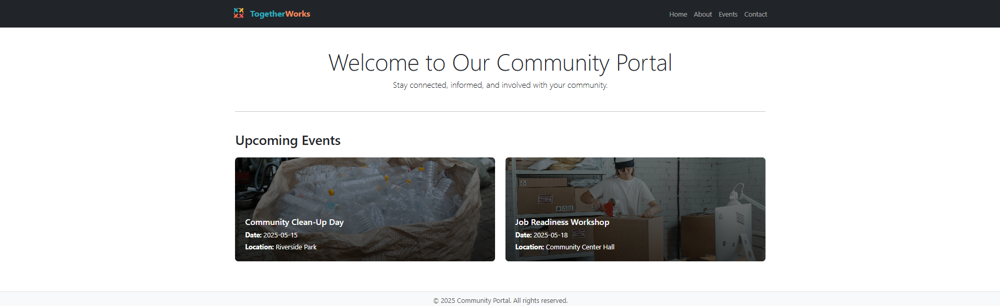
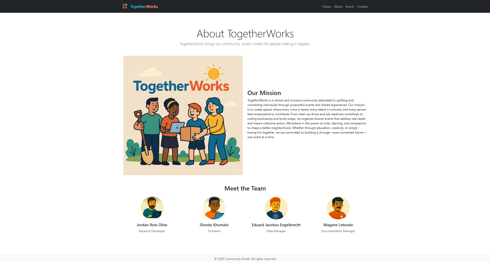
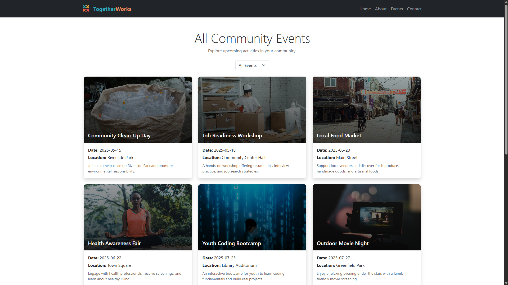
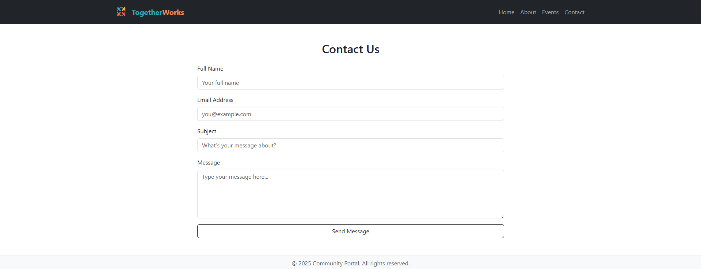
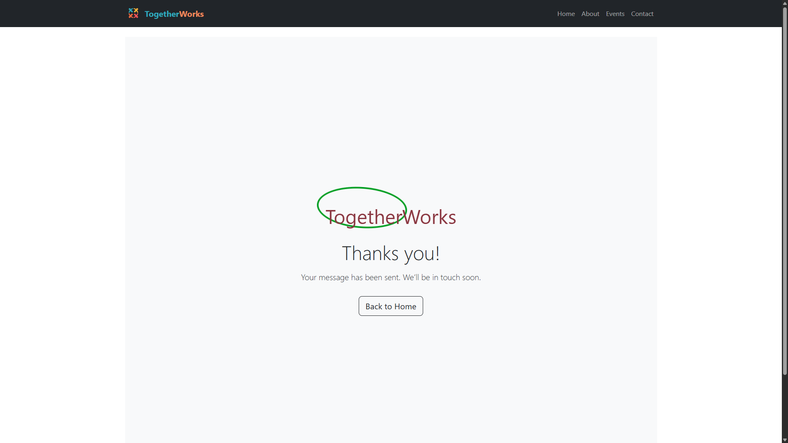

## Project Overview

This project is a community portal website built using Node.js for the backend environment, Express.js as the server framework, and EJS as the templating engine. It consists of five structured web pages: Home, About, Events, Contact, and a Thank You confirmation page. The portal aims to provide a central hub for community members to stay informed, connected, and involved through dynamic content rendering, a functional contact form, and clear navigation.

## Technologies Used

The following technologies were utilized in the development of this project:
* Node.js (v18+)
* Express.js (v4+)
* EJS (v3+)
* CSS (or specify if Bootstrap 5 was used by your team, e.g., 'CSS / Bootstrap 5')
* Git & GitHub
* nodemon (for live development)

## Team Members and Roles

Our team collaborated to bring this community portal to life. Here are the assigned roles and team members:

* **Team Lead:** Eduard Jacobus Engelbrecht
* **Backend Developer:** Jordan Ross Olive
* **Frontend Developer:** Sfundo Khumalo
* **Data Manager:** Eduard Jacobus Engelbrecht
* **Documentation Manager:** Magane Letsoalo

## Setup Instructions

To set up and run this project locally, follow these steps:

1.  **Clone the repository:**
    ```bash
    git clone [Your GitHub Repository URL Here]
    ```
2.  **Navigate into the project directory:**
    ```bash
    cd community-portal
    ```
3.  **Install dependencies:**
    ```bash
    npm install
    ```
4.  **Start in development mode:**
    ```bash
    npm run dev
    ```
5.  **Access the application:**
    Open your web browser and navigate to `http://localhost:3000` (or the port configured in your `app.js` if different).

## Screenshots 

Below are screenshots demonstrating the key pages and functionalities of the Community Portal:

* **Home Page:**
    


* **About Page:**
    


* **Events Page:**
    
    

* **Contact Page:**
    
  

* **Thank You Page:**
    

   
## Reflection 

coming soon
